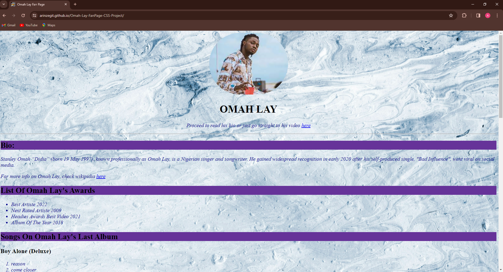

# Omah Lay Fanpage CSS Project

## Context and Description
This project was the final task of the [HTML5 and CSS Fundamentals](https://www.edx.org/learn/css/the-world-wide-web-consortium-w3c-html5-and-css-fundamentals) edX course. I was tasked with building a celebrity fanpage for my favourite artiste using the basic HTML elements I learned and CSS for styling.
## How to run
* Ensure you have a modern web browser installed
* Open the index.html file in your web browser
* The project should now be visible in your browser
* You can also visit the live site URL [here](https://arinzegit.github.io/Omah-Lay-FanPage-CSS-Project/)
## Technologies used
* HTML
* CSS
## Challenges faced during development
* Setting height and width of media elements distorted them
  * I discovered the value 'auto' for width and height properties that maintained the intrinsic aspect ratios of media
